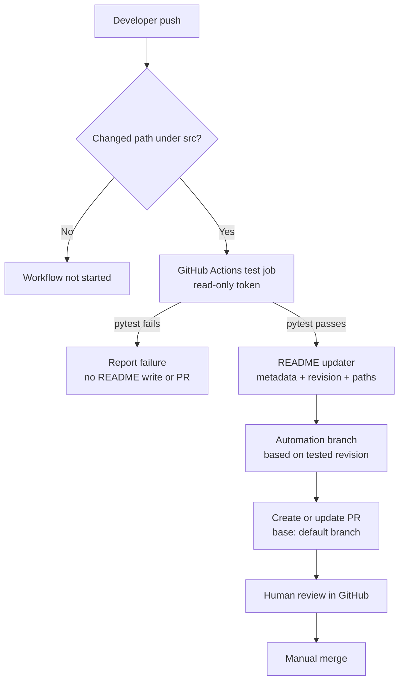

# Architecture: Automatic README Update

## Status

Proposed architecture approved by the human reviewer on 2026-09-30. Implementation is not yet authorized; design review and implementation planning remain.

## Goals and Constraints

This design implements the approved requirements in [requirements.md](requirements.md):

- Run automation only for pushes to `main` that change source files under `src/**`.
- Run `pytest` before feature extraction, README modification, or PR operations.
- Read feature labels from `src/features.py` using `features()` and render them verbatim.
- Modify only the README region bounded by the exact documentation-sync markers.
- Create the initial documentation-sync PR if absent, then update it on later runs.
- Target `main` and leave merging to a human.

## Components

| Component | Responsibility |
| --- | --- |
| GitHub Actions workflow | Filter source changes, establish the job environment, run tests first, and coordinate update and PR steps. |
| `src/features.py` | Provide the user-maintained `features()` function returning a list of exact display labels. |
| README updater | Load the feature list and safely replace only the text between the required markers. Abort without writing if the README or markers are invalid. |
| Git automation | Commit the generated README to a stable automation branch and create or update its PR against `main`. |
| `pytest` suite | Verify feature retrieval, marker handling, exact label output, and preservation of README content outside the managed region. |

## Recommended Technologies

- GitHub Actions for event filtering and orchestration.
- The repository's Python runtime for the updater and feature provider.
- `pytest` for the required pre-update test gate and updater behavior tests.
- GitHub Actions' built-in `GITHUB_TOKEN` with only the repository-content and pull-request permissions needed to push the automation branch and manage its PR.
- Git and GitHub CLI (`gh`) or an equivalent maintained action for checking for the PR, creating it when absent, and reporting its URL. Avoid storing a long-lived personal access token.

## Data Flow

1. A push to `main` changing one or more files under `src/**` starts the workflow. Other branches and pushes without matching source changes do not start it.
2. The workflow checks out the pushed `main` revision and runs `pytest`.
3. If tests fail, the job stops and reports the failure; no updater or PR operation runs.
4. If tests pass, the updater imports and calls `features()` from `src/features.py`.
5. The updater validates that `README.md` contains one well-formed start/end marker pair in the correct order.
6. The updater renders the returned labels exactly, replacing only the managed region. It makes no change to text outside the markers.
7. Git automation pushes the result to a stable documentation-sync branch. A PR for that branch against `main` is created if absent; otherwise the existing PR is updated by pushing the branch changes.
8. The workflow reports the result and PR URL. A human reviews and merges the PR.

## Component Diagram

```mermaid
flowchart TD
    A[Push changing src/**] --> B[GitHub Actions workflow]
    B --> C[Run pytest]
    C -->|Failure| D[Report failure and stop]
    C -->|Pass| E[Call src/features.py features()]
    E --> F[Validate README markers]
    F -->|Invalid| G[Fail without writing]
    F -->|Valid| H[Replace managed README region]
    H --> I[Push stable automation branch]
    I --> J{Matching open PR exists?}
    J -->|No| K[Create PR targeting main]
    J -->|Yes| L[Update existing PR branch]
    K --> M[Human review and merge]
    L --> M
```

## README Update Contract

The updater owns only the content between these exact markers:

```markdown
<!-- docs-sync:start -->
<!-- docs-sync:end -->
```

The markers themselves and all text outside them are preserved. Each returned feature label is emitted without renaming or translation. Marker validation and update should be performed in memory before writing so invalid input cannot partially modify the README.

## Workflow and PR Strategy

- Configure the workflow for pushes to `main` with a path filter for `src/**` and ensure a failed test step prevents every downstream update step.
- Use a stable automation branch so subsequent successful runs update one PR instead of creating duplicates.
- Identify the managed PR by its stable head branch and `main` base; create it if no open match exists.
- Grant only the permissions required to read repository contents, push the automation branch, and create/update pull requests. Do not expose secrets in logs.
- Do not enable automatic merging.

## Branch and Revision Strategy

The workflow is restricted to pushes on `main`, as approved by the human reviewer. It checks out and tests the pushed `main` revision, then derives the documentation update from that same revision. This avoids generating a README update from unmerged feature-branch code. The dedicated automation branch contains the generated README change, and its PR targets `main`. See [design-review.md](design-review.md) for the review decision.

## Failure Behavior

- Test failure: stop before feature extraction and any write or PR action.
- Missing `src/features.py`, missing/non-callable `features()`, or invalid return value: fail clearly without changing README or PR.
- Missing, duplicated, reversed, or malformed markers: fail clearly without changing README or PR.
- No generated README diff: do not create an empty commit or duplicate PR; report that no update was needed.
- GitHub API or push failure: fail the job with actionable context while keeping credentials out of output.

## Superseded Draft Notice

The appended draft below is retained as historical material only. It conflicts with the current approved [requirements.md](requirements.md) and the architecture above: in particular, it proposes metadata-derived content and non-`main` source triggers. Do not use that draft for implementation. The controlling design uses `features()` labels verbatim and triggers only for pushes to `main` changing `src/**`.

# Superseded Architecture Draft (Historical, Not Approved)

**Status:** Human-approved; Stage 4 implementation planning authorized  
**Requirements source:** [requirements.md](requirements.md), approved by the human developer

## Architecture Overview

Use one GitHub Actions workflow to detect changes under `src/`, test the pushed revision, generate a deterministic README section from project and Git metadata, and open or update a pull request. The generated section records the tested source revision and the paths changed under `src/`; it does not attempt to infer behavioral changes or generate an AI summary.

The design has two sequential jobs. The test job has read-only repository permissions. Only after it succeeds does the update job receive the minimum write permissions needed to commit the generated README and create or update a pull request. The PR includes the tested source revision when the triggering push was to a non-default branch, keeping documentation review tied to the code it describes.

## Components and Responsibilities

| Component | Responsibility |
| --- | --- |
| GitHub Actions workflow | Start on pushes that change any path matching `src/**`. Changes only outside `src/` do not start this workflow. |
| Test job | Check out the pushed revision, set up Python, install the project and test dependencies, and run `pytest`. It has read-only repository permissions. |
| README updater (`scripts/update_readme.py`) | Read project metadata and the push's changed `src/` paths, render stable README text, and replace only the workflow-managed README region. It performs no network calls and uses no AI service. |
| Pull request job | Run only after tests and README generation succeed. Create or update a dedicated automation branch based on the tested revision, then create or update a pull request against the default branch. For a non-default source branch, the PR therefore contains the tested source change and its README update together. It never merges. |
| Git repository | Store source, tests, project metadata, README, and workflow configuration. No separate database or service is required. |

## Technology Choices

- **GitHub Actions** for push detection and CI orchestration. Configure the push path filter as `src/**`, matching the approved path-based rule regardless of file extension.
- **Python 3.11 or newer** for the project automation script. Python's standard-library `tomllib` can read metadata from `pyproject.toml` without adding a TOML parsing dependency.
- **`pytest`** for the required project test suite.
- **`pyproject.toml`** as the canonical project metadata source. Project name is required; description and version are optional and omitted when absent or dynamically supplied. Missing project name is an error and prevents a write.
- **Git push metadata** as the source-change record: include the full tested revision SHA and the sorted, Markdown-escaped paths changed under `src/` in that push. Do not include commit messages or infer behavioral claims. The revision/path record ensures every in-scope push is represented deterministically even when project-level metadata is unchanged.
- **A maintained pull-request creation action** to commit changes on the automation branch and open/update the PR. Pin third-party actions to reviewed immutable commit SHAs and keep the action limited to the PR job.
- **GitHub-provided `GITHUB_TOKEN`** for repository writes and pull-request operations; do not add a personal access token or external secret for this workflow.

## README Update and Preservation Policy

The updater owns only a delimited section in `README.md`:

```markdown
<!-- docs-sync:start -->
## Project

- Name: project-name
- Description: project description
- Version: 1.0.0

## Recent source update

- Revision: full-tested-commit-sha
- Changed paths:
    - `src/module.py`
<!-- docs-sync:end -->
```

On each successful run, it renders project name, optional description and version, the full tested revision SHA, and the lexically sorted paths changed under `src/` in that push. Paths are Markdown-escaped. It replaces only the text between the markers; text outside them is preserved byte-for-byte where practical. The revision/path record is deterministic, changes for every distinct source push, and makes no semantic claims about code behavior.

Bootstrap and failure behavior:

- If `README.md` does not exist, create it with a project heading and the generated section.
- If the README exists but has no markers, append the generated section without rewriting existing content.
- If only one marker exists, markers are duplicated, the project name is missing, or the tested revision/path set cannot be determined, fail without writing a README and report the reason in the workflow log.
- If description or version is absent or supplied dynamically, omit that field; do not fail the update.

These rules provide a safe first run and prevent accidental replacement of unmanaged README content.

## Data Flow

1. A developer pushes a revision containing an added, modified, deleted, or renamed path under `src/`.
2. GitHub Actions starts the workflow because the push path filter matches `src/**`. A push whose changed paths are all outside `src/` does not start it.
3. The read-only test job checks out the revision, installs the project and test dependencies, then runs `pytest`.
4. If `pytest` fails, the workflow reports failure; the update job is skipped and no README change or PR is made.
5. If tests pass, the update job reads project metadata and the push's changed `src/` paths, then renders the managed README section with the tested commit SHA and sorted changed paths.
6. The update job creates or updates an automation branch based on the exact tested revision and commits the README update there. For a non-default source branch, the resulting PR contains that source revision together with its README update. For a default-branch push, the source change is already on the default branch and the PR contains only the README update.
7. A human reviews and merges the PR through GitHub. The workflow does not merge it.

## Component Diagram



## Testing Approach

- Unit-test metadata loading, stable rendering, and replacement of the managed README section.
- Verify that each source push produces a section containing the tested revision SHA and the sorted changed `src/` paths, even when project metadata is unchanged.
- Verify user-authored content before and after the generated section is preserved.
- Cover first-run behavior for a missing README and an existing README without markers.
- Verify malformed markers, missing project name, or unavailable source-change metadata fail without modifying the README; verify absent optional fields are omitted.
- Run the full `pytest` suite in the workflow before the updater job is eligible to run.
- Review the workflow path filter and job dependencies to confirm that only `src/**` changes trigger it, a failed test job prevents all README/PR writes, and the PR is based on the tested revision.

## CI/CD and Permissions

- Trigger on `push` with a `paths` filter for `src/**`.
- Run tests in a job with only `contents: read` permission.
- Make the update/PR job depend on successful completion of the test job. Grant it only `contents: write` and `pull-requests: write` permissions.
- Use the repository's default branch as the PR base and a stable automation branch per source branch. Base the automation branch on the tested revision: feature-branch PRs include source and README changes together, while default-branch pushes produce a README-only PR.
- Do not expose write credentials to test commands. Do not automatically merge generated PRs.
- Keep the workflow and updater in the same repository; there is no deployment environment or long-running service.

## Requirement Coverage

| Requirement | Architectural support |
| --- | --- |
| FR1 / AC1-AC2: trigger on `src/` changes only | GitHub Actions push path filter `src/**`. |
| FR2 / AC3: run `pytest` before README changes | A read-only test job must succeed before the dependent update job runs. |
| FR3 / AC4: deterministic metadata-based update | Python updater reads `pyproject.toml` and records the tested commit SHA plus sorted changed `src/` paths, so every source push results in a meaningful deterministic update without an AI summary. |
| FR4 / AC5: preserve relevant README content | The updater changes only its delimited section; first-run append/create behavior is proposed above. |
| FR5 / AC6: make the change reviewable | The PR job creates or updates a pull request and does not merge it. |
| FR6 / AC7: fail safely | Test failure skips the update job, so the README cannot be changed by this workflow. |

## Stage 2 Review Checklist

- [x] The architecture addresses the approved requirements.
- [x] Component responsibilities are defined.
- [x] Data flow is described, including the test-failure path.
- [x] Technology choices are listed and kept small.
- [x] No database, API service, microservice, or cloud infrastructure is introduced.
- [x] Human approval to proceed to Stage 3 design review.
- [x] Resolve the source-to-README and PR/source-branch findings from Stage 3 review.
- [x] Define required/optional metadata behavior and README bootstrap policy.
- [x] Human review and approval of this revised architecture before Stage 4 planning.